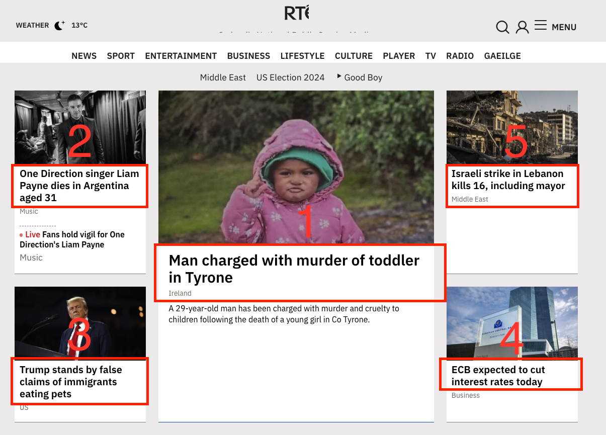
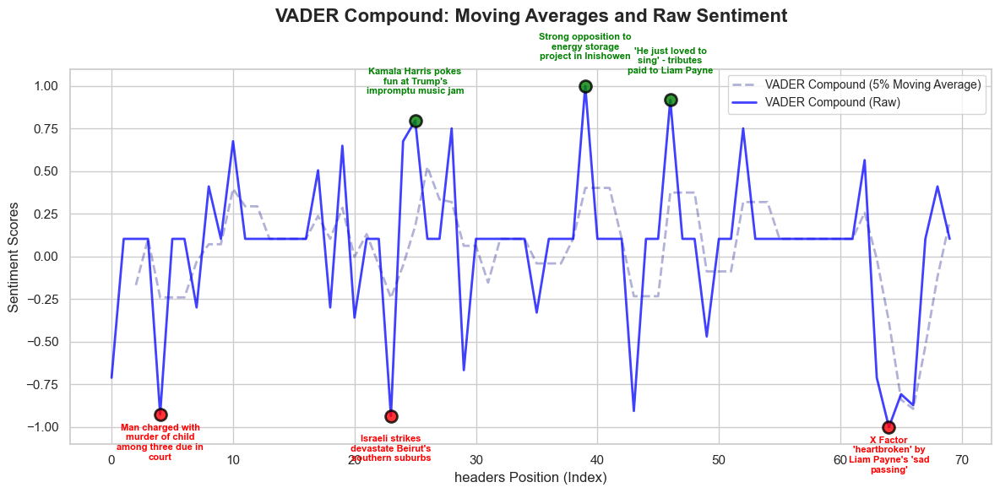

# Web Scraper with Sentiment Analysis Using VADER

## Overview
This project is a web scraping tool designed to extract headlines from a target website, clean up the HTML by removing unnecessary tags and elements, and perform sentiment analysis on the headlines using the VADER sentiment analysis model. The results are visualized using Matplotlib and Seaborn, and the sentiment analysis data can be saved to a CSV file for future reference.

## Features
- **Web Scraping**: Fetches web content using Selenium and strips unwanted HTML elements.
- **HTML Parsing**: Cleans and extracts headlines (`<h3>` and `<h5>` tags) from the target page using BeautifulSoup.
- **Sentiment Analysis**: Analyzes the sentiment of the extracted headlines using VADER.
- **Data Visualization**: Visualizes sentiment scores with moving averages and adds annotations for the most positive and negative headlines.
- **CSV Export**: Saves sentiment analysis results to a CSV file.

## Requirements

To run the project, you need the following Python libraries installed:

- `selenium`
- `beautifulsoup4`
- `matplotlib`
- `seaborn`
- `pandas`
- `vaderSentiment`
- `numpy`

To install the required libraries, use:

```bash
pip install selenium beautifulsoup4 matplotlib seaborn pandas vaderSentiment numpy
```

You will also need the Chrome WebDriver for Selenium. Ensure it is installed and accessible in your system's PATH or provide its path in the script.

## Usage

### 1. Fetching Web Content
The script fetches web content using Selenium:

```python
url = 'https://www.rte.ie/'  # Replace with the RTÉ page or any target page
html_content = fetch_website_with_selenium(url)
```

Make sure to replace the `url` variable with the URL of the page you want to scrape.





### 2. HTML Parsing and Cleaning
The `strip_html` function removes unwanted HTML elements (like scripts, styles, and specific IDs or classes), removes duplicates, and extracts headlines (`<h3>` and `<h5>` tags) from the page.

```python
to_remove_ids = ['embedWrapper', 'panel-podcasts-we-love', 'panel-best-of-rte-player']
to_remove_classes = ['panel-heading', 'head-row', 'row buttonbar']
tags_to_extract = ['h3', 'h5']

if html_content:
    extracted_content = strip_html(html_content, to_remove_ids, to_remove_classes, tags_to_extract)
```


### 3. Sentiment Analysis
The `headline_analyser` function uses VADER to analyze the sentiment of the extracted headlines, returning a list of dictionaries with the sentiment scores for each headline.

### 4. Data Visualization
You can visualize the sentiment data using the `plot_moving_averages` function, which displays moving averages of the sentiment scores along with raw sentiment data. The `add_annotations` function adds circles and annotations for the most positive and negative headlines.



### 5. Saving Results to CSV
After performing the sentiment analysis, you can save the results to a CSV file using the `save_sentiment_analysis_to_csv` function.

